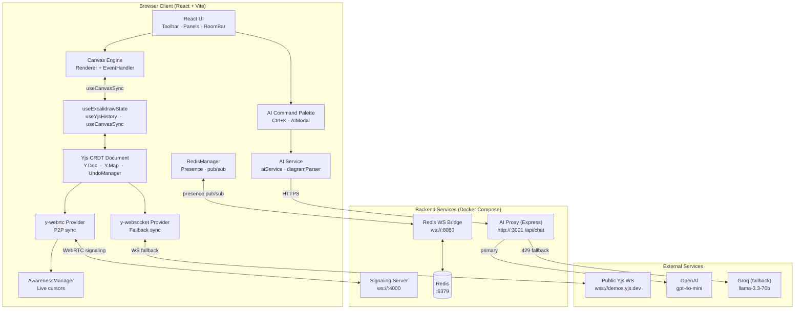

# Scriblio — AI-Powered Collaborative Whiteboard


A real-time collaborative whiteboard with CRDT-based sync, WebRTC peer-to-peer networking, and an AI assistant that generates diagrams from natural language.

---



## Features

- **Real-time collaboration** — [Yjs](https://github.com/yjs/yjs) CRDTs with [`y-webrtc`](https://github.com/yjs/y-webrtc) for peer-to-peer sync, plus a custom WebSocket signaling server
- **Hybrid networking** — WebRTC (P2P) with WebSocket fallback
- **Live cursors** — teammates' cursors and selections in real time via the Yjs awareness protocol
- **Drawing tools** — Selection, rectangle, ellipse, diamond, arrow, line, freehand, text, image, eraser
- **AI assistant** — Press `Ctrl+K` / `⌘K` to generate diagrams, summarize the canvas, or get layout suggestions
- **Undo / Redo** — Full history with `Ctrl+Z` / `Ctrl+Y`
- **Export / Import** — Save and load board state as JSON
- **Properties panel** — Adjust stroke color, fill, width, roughness, and opacity per item

---

## Tech Stack

| Layer | Technology |
|---|---|
| Frontend | React 19, TypeScript, Vite, TailwindCSS |
| Drawing | Custom canvas engine + RoughJS |
| Collaboration | Yjs (CRDT), y-webrtc, y-websocket |
| Real-time | WebSocket signaling server, Redis pub/sub bridge |
| AI | Express proxy → OpenAI `gpt-4o-mini` (Groq `llama-3.3-70b-versatile` fallback) |

---

## Architecture

```
Browser client
├── Yjs document (CRDT state)
│   ├── y-webrtc  → WebRTC P2P  → Signaling server (ws://localhost:4000)
│   └── y-websocket → WebSocket → wss://demos.yjs.dev (public fallback)
├── Redis bridge (ws://localhost:8080) → Redis pub/sub
│   └── presence & signaling channels
└── AI assistant → AI proxy (http://localhost:3001/api/chat)
                   └── OpenAI gpt-4o-mini  (Groq llama fallback)
```

Rooms are identified by the URL hash (e.g. `http://localhost:5173/#myroom`). Share the URL to invite collaborators into the same session.

---

## Quick Start

Docker Compose runs the whole stack (Redis, signaling, AI proxy, frontend)
in one command:

```bash
git clone https://github.com/suwubh/Scriblio.git
cd Scriblio

# Optional: API keys for the AI palette
echo "OPENAI_API_KEY=your_key_here" > .env
# echo "GROQ_API_KEY=your_key_here" >> .env

docker compose up --build
# frontend       http://localhost:5173
# signaling      ws://localhost:4000  (health: http://localhost:4001/health)
# redis bridge   ws://localhost:8080
# AI proxy       http://localhost:3001
```

To run the services natively instead, follow the manual setup below.

### Prerequisites (manual setup)

- **Node.js** ≥ 18
- **npm**
- **Redis** (local install or Docker)

### 1. Clone and install

```bash
git clone https://github.com/suwubh/Scriblio.git
cd Scriblio
npm install
```

### 2. Environment setup

Copy the example files and fill them in:

```bash
cp .env.example .env.local        # frontend (Vite) config
cp server/.env.example server/.env # AI proxy keys
```

The frontend `.env.local` points at the local services:

```bash
VITE_SIGNALING_URLS=ws://localhost:4000
VITE_REDIS_WS_URL=ws://localhost:8080
VITE_WEBSOCKET_URL=wss://demos.yjs.dev/ws
VITE_PROXY_URL=http://localhost:3001/api/chat
```

The AI proxy `server/.env` holds the API keys and the allowed frontend origin:

```bash
OPENAI_API_KEY=your_openai_key_here
GROQ_API_KEY=your_groq_key_here   # optional fallback
PORT=3001
ALLOWED_ORIGIN=http://localhost:5173
```

> The app also works without Redis and without an AI key — collaboration falls back to the public Yjs WebSocket server, and the AI panel will show a connection error.

---

## Running Locally

Four processes need to run simultaneously. Open four terminal windows.

### Terminal 1 — Redis

```bash
# Docker (recommended)
docker run -d -p 6379:6379 --name scriblio-redis redis:alpine

# Or local install (macOS)
brew services start redis

# Verify
redis-cli ping   # should print: PONG
```

### Terminal 2 — WebRTC signaling server

```bash
cd signaling-server
npm install
npm start
# → WebSocket server on ws://localhost:4000
# → Health check at http://localhost:4001/health
```

### Terminal 3 — Redis WebSocket bridge

```bash
cd redis-server
npm install
npm start
# → WebSocket bridge on ws://localhost:8080
```

### Terminal 4 — AI proxy

```bash
cd server
npm install
npm start
# → Express API on http://localhost:3001
```

### Terminal 5 — Frontend

```bash
# from project root
npm run dev
# → http://localhost:5173
```

Open `http://localhost:5173` in your browser. A room ID is automatically generated and added to the URL hash. Share that URL with anyone to collaborate in the same room.

---

## Folder Structure

```
Scriblio/
├── src/
│   ├── collaboration/       # Yjs providers, WebRTC/Redis managers, presence hooks
│   ├── components/          # React UI (canvas, toolbar, panels, AI modal)
│   ├── engine/              # Canvas renderer and pointer event handler
│   ├── hooks/               # useScriblioState, useUndoRedo
│   ├── services/            # aiService.ts — AI API client
│   ├── types/               # TypeScript definitions
│   └── App.tsx
├── signaling-server/        # WebRTC signaling (ws, port 4000)
├── redis-server/            # Redis pub/sub bridge (ws, port 8080)
└── server/                  # AI proxy (Express, port 3001)
```

---

## Troubleshooting

| Problem | Fix |
|---|---|
| Redis connection failed | Run `redis-cli ping` and confirm Redis is running |
| Signaling server not found | Check `ws://localhost:4000` is reachable; verify Terminal 2 is running |
| AI not responding | Confirm `OPENAI_API_KEY` is set in `server/.env`; check Terminal 3 logs |
| Port already in use (Windows) | `netstat -ano \| findstr :<PORT>` then `taskkill /PID <PID> /F` |
| Port already in use (macOS/Linux) | `lsof -ti:<PORT> \| xargs kill` |

---

## Load Testing

The signaling server has a `/bench` WebSocket path that echoes JSON pings,
which [k6](https://k6.io/) uses to measure round-trip latency without
touching the Yjs binary protocol.

```bash
# with the stack running:
k6 run --out json=proof/loadtest-scriblio-results.json \
       proof/loadtest-scriblio.js \
       | tee proof/loadtest-scriblio-output.txt
```

Full results and notes in [`proof/`](./proof/).

---

## Production Build

```bash
npm run build    # outputs to dist/
npm run preview  # test production build locally
```

Deploy `dist/` to any static host (Vercel, Netlify, S3). The signaling server, Redis bridge, and AI proxy need to be deployed separately and their URLs updated in environment variables.

---

## Roadmap

- [ ] Persistent room storage (PostgreSQL / MongoDB)
- [ ] User accounts and room permissions
- [ ] Mobile touch support improvements
- [ ] Export to PNG and PDF

---

## License

MIT — see [LICENSE](./LICENSE).

---

Made by [suwubh](https://github.com/suwubh)
